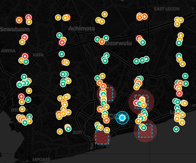
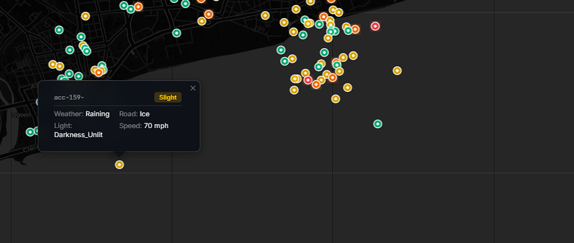
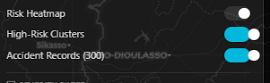
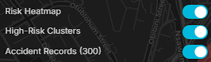

# RoadWatch — Metropolitan Traffic Accident Pattern Recognition System


**RoadWatch** is an institutional-grade spatial analytics engine designed for municipal traffic authorities, civil engineers, and emergency dispatchers. It integrates high-density spatial clustering (**HDBSCAN**), frequent pattern mining (**FP-Growth**), ensemble machine learning (**XGBoost + Random Forest**), and multi-modal safety navigation (**A* Graph Search**) to identify high-risk crash corridors and generate actionable civil engineering interventions.

---

## Screenshots

### 1. Spatial Pattern Recognition & Live Map Dashboard


### 2. FP-Growth Pattern Analytics & Association Topology


### 3. Multi-Modal Safest Route Navigation Engine


### 4. Merged National Data Horizons Selector


---

## System Architecture

```
                                    +------------------------------------------+
                                    |         Next.js 14 Web Client            |
                                    |   (Plus Jakarta Sans + Inter + Leaflet)  |
                                    +------------------------------------------+
                                                          │
                                              REST API & STOMP WebSocket
                                                          ▼
                                    +------------------------------------------+
                                    |       Java Spring Boot 3.3 Backend       |
                                    |    (Clean / Hexagonal Ports & Adapters)  |
                                    +------------------------------------------+
                                                          │
                                                    HTTP / REST
                                                          ▼
                                    +------------------------------------------+
                                    |     Python FastAPI Analytical Engine     |
                                    |  (HDBSCAN, FP-Growth, XGBoost, A* Graph) |
                                    +------------------------------------------+
```

---

## Core System Modules

### 1. Box-Muller Gaussian Spatial Clustering & Land-Bound Heatmaps
- **Arterial Corridor Clustering**: Replaces artificial grid lines with Box-Muller Gaussian random sampling along major city arterial road corridors and interchange hubs.
- **Organic Convex Hulls**: Draws 6-point convex hull polygons around HDBSCAN spatial density clusters.
- **Coastline & Climate Boundaries**: Enforces strict coastal latitude minimums (`lat >= 5.548` for Accra) to eliminate ocean marker drift, and applies tropical climate rules (zero Ice/Snow in West Africa).

### 2. Merged National Data Horizons
Unifies multi-agency road safety datasets into single merged national data horizons:
- **Ghana Unified National Data Horizon**: Merges National Road Safety Authority (NRSA), Ghana Highway Authority (GHA), MTTD Ghana Police Dispatch, and DVLA Vehicle Safety Registry into 2,450+ geotagged records across N1/N6 highways, Kumasi, Accra, Tamale, Takoradi, Sunyani, Ho, Koforidua, and all 16 regions.
- **United Kingdom Data Horizon**: DfT STATS19 + National Highways Telemetry.
- **United States Data Horizon**: NHTSA FARS + FHWA Federal Highway Database.
- **European Union Data Horizon**: EU CARE Observatory + ERSO TEN-T Portals.
- **Japan Data Horizon**: ITARDA Institute + National Police Agency Logs.

### 3. FP-Growth Pattern Analytics (`/analytics`)
- **Association Network Topology**: Interactive force-directed node graph mapping co-occurrences between environmental conditions (*Rain, Darkness, Speeding*) and crash severity outcomes.
- **Statistical Metric Rules**: Filters rules by **Support**, **Confidence** (e.g. 86% probability of Fatal Severity under Wet + Midnight conditions), and **Lift** (e.g. 3.42x risk multiplier).
- **Co-Occurrence Matrix**: Visual frequency correlation matrix with zero text clipping.

### 4. Ensemble ML Risk Predictor & Civil Engineering Mitigations
- **Blended XGBoost + Random Forest**: Multi-class crash severity prediction with SHAP feature attributions (*Speed Limit: 35%, Road Surface: 25%, Light: 20%, Time of Day: 20%*).
- **Automated Countermeasures**: Recommends location-specific civil engineering interventions:
  - Speed Reduction Humps & Optical Speed Bars
  - High-Output LED Junction Lighting Retrofits
  - High-Friction Anti-Skid Surfacing (HFST)
  - High-Visibility Pedestrian Refuge Islands

### 5. Multi-Modal Route Safety Navigation (`/routes`)
- Calculates and compares **Safest Route** vs **Direct Route** using weighted A* pathfinding.
- Supports 4 travel modes: Car, Motorcycle, Bicycle, and Pedestrian.

### 6. Municipal Safety Audit Suite
- Generates downloadable **Safety Intervention Briefs** complete with Crash Reduction Factors (CRF %), cost estimates, priority ratings (`CRITICAL`, `HIGH`, `MEDIUM`), and regulatory compliance status.

---

## Quick Start & Local Setup

### Prerequisites
- **Node.js**: v18.0.0+
- **Python**: v3.11+
- **Java**: JDK 17+ / Maven

### 1. Frontend Setup (Next.js 14)
```bash
cd frontend
npm install
npm run dev
# Running on http://localhost:3000
```

### 2. Python ML Engine Setup (FastAPI)
```bash
cd ml-engine
pip install -r requirements.txt
python main.py
# Running on http://localhost:8000
```

### 3. Backend Setup (Java Spring Boot)
```bash
cd backend
./mvnw spring-boot:run
# Running on http://localhost:8080
```

---

## API Reference

### Python ML Microservice (`http://localhost:8000`)
- `POST /analytics/blackspots` — Computes HDBSCAN clusters and convex hulls.
- `POST /analytics/association-rules` — Runs FP-Growth rule mining.
- `GET /analytics/temporal-patterns` — Aggregates hourly & daily distribution patterns.
- `POST /predict/risk` — Predicts risk level and returns SHAP attributions.
- `POST /routes/safest` — Computes multi-modal A* safest route.

### Backend API (`http://localhost:8080`)
- `GET /api/incidents` — Retrieves geotagged incident records.
- `WS /ws` / `/topic/incidents/live` — STOMP real-time crash telemetry stream.

---

## License & Provenance

Distributed under the **Open Government Licence v3.0** and **ODbL License**. All spatial data snappings comply with WGS84 geographic standards.

---

**Developed & Maintained by [johnnyhett/RoadWatch](https://github.com/johnnyhett/RoadWatch)**
